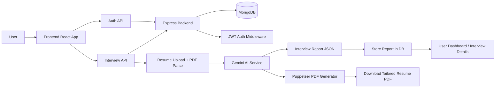

# CareerLens

CareerLens is an AI-powered interview preparation platform that helps users prepare for job interviews by analyzing their resume, self-description, and target job description. It generates:

- personalized interview reports
- technical and behavioral interview questions
- skill gap analysis
- day-wise preparation plans
- resume PDF tailored to the job role

## Tech Stack

### Frontend
- React
- Vite
- React Router
- Axios
- SCSS

### Backend
- Node.js
- Express
- MongoDB with Mongoose
- JWT authentication
- Cookie-based auth
- Multer for file uploads
- Google GenAI / Gemini for report generation
- Puppeteer for PDF generation

## Project Structure

```text
JobFit/
├── Backend/
│   ├── src/
│   │   ├── app.js
│   │   ├── config/
│   │   ├── controllers/
│   │   ├── middlewares/
│   │   ├── models/
│   │   ├── routes/
│   │   ├── services/
│   │   └── ...
│   ├── .env
│   ├── .gitignore
│   ├── package.json
│   ├── server.js
│   └── ...
├── Frontend/
│   ├── src/
│   ├── public/
│   ├── .env
│   ├── .gitignore
│   ├── package.json
│   ├── vite.config.js
│   └── ...
├── README.md
└── .git/
```

## Features

- User registration and login
- Protected routes for authenticated users
- Resume upload and parsing
- AI-generated interview insight report
- Personalized skill gap detection
- Preparation plan generation
- Resume PDF export
- Interview history tracking

## Workflow



## How it Works

1. The user signs up or logs in through the frontend.
2. The frontend sends authenticated requests to the backend using cookies and JWT.
3. The user uploads a resume and enters job description + self-description.
4. The backend parses the uploaded resume and sends the data to the Gemini AI service.
5. The AI generates:
   - match score
   - technical questions
   - behavioral questions
   - skill gaps
   - preparation plan
   - interview report summary
6. The report is saved in MongoDB and returned to the frontend.
7. The user can also generate a tailored resume PDF from the saved interview data.

## API Overview

### Authentication

- `POST /api/auth/register` - register a new user
- `POST /api/auth/login` - login and create JWT cookie
- `GET /api/auth/logout` - logout and blacklist token
- `GET /api/auth/get-me` - fetch current user details

### Interview

- `POST /api/interview/` - generate interview report
- `GET /api/interview/report/:interviewId` - fetch report by ID
- `GET /api/interview/` - fetch all user interview reports
- `POST /api/interview/resume/pdf/:interviewReportId` - generate tailored resume PDF


## Environment Variables

### Backend
Create a `.env` file inside `Backend/`:

```env
MONGO_URI=your_mongodb_connection_string
JWT_SECRET=your_jwt_secret
GOOGLE_GENAI_API_KEY=your_google_genai_key
PORT=3000
```

### Frontend
Create a `.env` file inside `Frontend/`:

```env
VITE_BACKEND_URL=http://localhost:3000
```

> Use the deployed backend URL when hosting the frontend on Vercel or another platform.

## Installation

### 1. Clone the repository

```bash
git clone <your-repository-url>
cd JobFit
```

### 2. Install backend dependencies

```bash
cd Backend
npm install
```

### 3. Install frontend dependencies

```bash
cd ../Frontend
npm install
```

## Run the Project

### Start the backend

```bash
cd Backend
npm run dev
```

### Start the frontend

```bash
cd Frontend
npm run dev
```

The frontend usually runs at:

```text
http://localhost:5173
```

The backend usually runs at:

```text
http://localhost:3000
```


## Notes

This project follows the pattern of a full-stack AI app where the frontend handles user interaction, the backend manages authentication and business logic, and the AI service performs analysis and content generation.

## License

This project is provided for educational and portfolio use.
